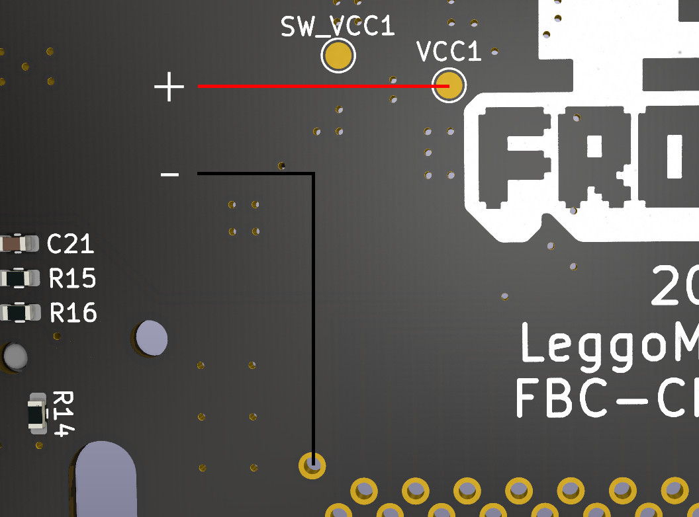
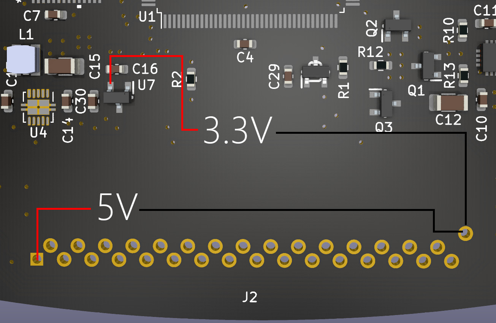
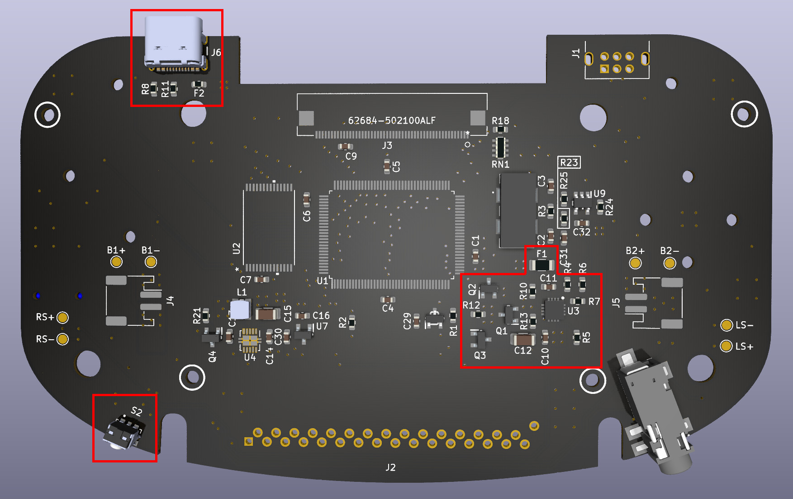

# Frog Boy Color

The Frog Boy Color is a reimagining of the Nintendo Game Boy Color, aka the greatest Game Boy ever made. Taking the best parts of a modded GBC -- large screen with correct aspect ratio, no cartridges sticking out, etc -- and marrying them to a horizontal format ala the GBA, the Frog Boy is the realization of exactly the kind of Game Boy I've wanted since I initially jumped into modding. 

Features include:
- All features of the original GBC minus IR -- use of GB/GBC cartridges, link cable, headphone jack, etc.
- Compatibie with popular laminated backlit screen kits from FunnyPlaying and others
- Dual speakers for stereo sound
- Internal battery rechargable via USB-C
- Tactile buttons like the GBA SP
- Two stage battery indicator

The following is a guide on how you can build your very own Frog Boy.

# Disclaimer/Warning/For the love of God, read this
The Frog Boy is not an easy project, nor is it a professional product, and as such there are some things to keep in mind as you consider building one.

Assembly of the Frog Boy requires intermediate-advanced skills in soldering and electronics tinkering, including:
- Desoldering/soldering of large ICs
- Desoldering of through hole parts
- Soldering of small surface mount devices
- Soldering of leadless ICs, for example the TSP61202
- Proficiency with a multimeter for troubleshooting and validation
This is in no way a project for beginners, and if you don't have experience with the above, I highly recommend starting smaller -- solder practice kits are cheap and easily available.

Along with needing the requisite skills, there is a very real possibility that you will irreparably damage either your donor Game Boy Color, or the resulting Frog Boy. Even the most skilled among us make mistakes, but it's important to keep in mind your own limits to avoid heartache and sorrow.

I am in no way a professional electrical engineer. All of my skills are self taught, or learned from other members of the modding community. While I have taken common sense measures to ensure that the Frog Boy is functional and safe, I can not guarantee that each and every decision made is correct. Build at your own discretion.

In summary, build at your own risk. I am not liable for any damage caused by your insatiable need to build a Game Boy named after an amphibian.

# Recommended Equipment
At a bare minimum, you should have:
- Temperature controlled soldering iron. I recommend the Pinecil as a great entry level option.
- Multimeter for troubleshooting. Any cheap digital multimeter from Amazon should do fine.
- Solder sucker for removing cartridge slot from donor GBC
- No clean flux

I highly recommend also having the following:
- A hot plate or hot air station for the QFN ICs, desoldering parts from GBC, etc
- Solder wick

# Bill of Materials(BOM)
Below is the breakdown of all materials you will need to build a Frog Boy Color.
## Build Components
### PCB

The PCB for the Frog Boy Color is a custom 4-layer circuit board made to hold all of the circuitry and fit within the custom shell.

Order here: LINK GOES HERE
### Shell
The shell for the Frog Boy Color is a fully custom design, and suitable for both resin printing and CNC machining.

Order here: LINK GOES HERE
### Buttons + Membranes
The Frog Boy Color uses buttons from the Game Boy Advance SP, either OEM or aftermarket. You will need a complete set, including the brightness button which is repurposed here for use as the power button.

Similarly, the membranes used are also from the Game Boy Advance SP. You will need two sets of these, as the start and select buttons utilize the membrane from the SP's brightness button, which most sets only include one of.
### Screen Kit
The FunnyPlaying laminated Q5 screen -- or a laminated Q5 from another manufacturer with the same total assembly thickness, such as from Gameneissance -- must be used in order to fit within the completed unit.

For the screen driver board, you have two options:
- FunnyPlaying GBC Retro Pixel 2.0 laminated IPS kit. This is the simplest option, as it can be purchased with the screen, and can be installed as is. The caveat is that the touch sensor will not work if you choose to install in an aluminum shell.
- Super OSD Retro Pixel IPS kit. The benefit of this kit is that most functions are available through button controls, which makes it a good choice for aluminum shells. The downside is that you generally can not purchase it with a suitable laminated screen, and the board-to-board ribbon cable is rather stiff, which can cause assembly issues. The latter can be mitigated by using my custom replacement.
### Batteries
The Frog Boy Color can be built with either one or two 804020 LiPo pouch cells. One battery is a simpler arrangement, at the expense of battery life. Two batteries are more complicated, as you'll be required to balance two cells prior to assembly, but with the benefit of roughly double the battery life.

NOTE: LiPo batteries can be dangerous if mishandled. NEVER use unprotected cells. It's always safer to use one cell if you're unsure of your ability to properly balance two cells.
## PCB Components
### Harvested GBC Parts
You will need a donor GBC -- CPU-06 revisions will NOT work -- that retains the following components in working order:
- CPU
- RAM
- Crystal
- Link port

### New parts
The full BOM for the remaining electrical components can be found in the repo.

# Recommended Assembly Procedure
At this point, if you feel confident in your skills, you can proceed with the complete build from PCB to final unit -- assembly after building the PCB is relatively straightforward.

However, I've devised an assembly strategy after assembling a few units that will allow you to check your work along the way, and I highly recommend that you follow along.
## PCB Assembly
### 1. Assembling and testing power circuitry
The power circuitry consists of regulated 5V(TPS61202) and 3.3V(MCP1799T) rails. Start by populating all of the components in the red box on this diagram:

You'll then want to test these components to verify that the 5V and 3.3V rails are working correctly. Start by connecting one of your LiPo cells to the VCC1 test pad and pin 32(GND) on the cart slot -- I highly recommend using a multimeter in continuity mode to confirm that these points are not shorted.

Next, with your meter in DC voltage mode, do the following two tests to verify that the 5V and 3.3V rails are outputting the expected voltage.

If everything looks good, you're ready to proceed to the next step.
### 2. Assembling and testing battery charging circuitry
At the heart of the battery charging circuit is the BQ24072TRGTR, which provides both battery charging and power path management -- the latter allows for simultaneous charge and play. Alongside the charging circuitry is a soft latching power circuit, that allows for the use of a momentary push button switch to control power, in contrast to the GBC's slide switch.

Again, start by populating the components indicated below:

### 3. Installing core GBC pieces
### 4. Assembly of remaining circuitry
