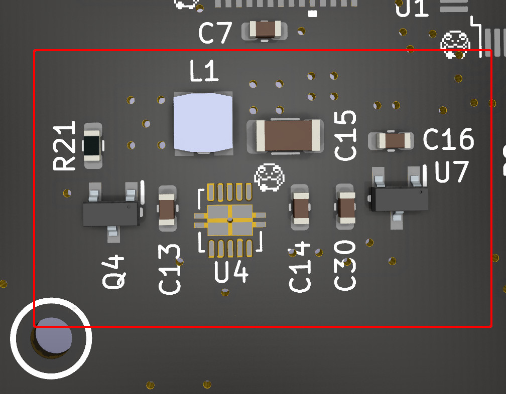
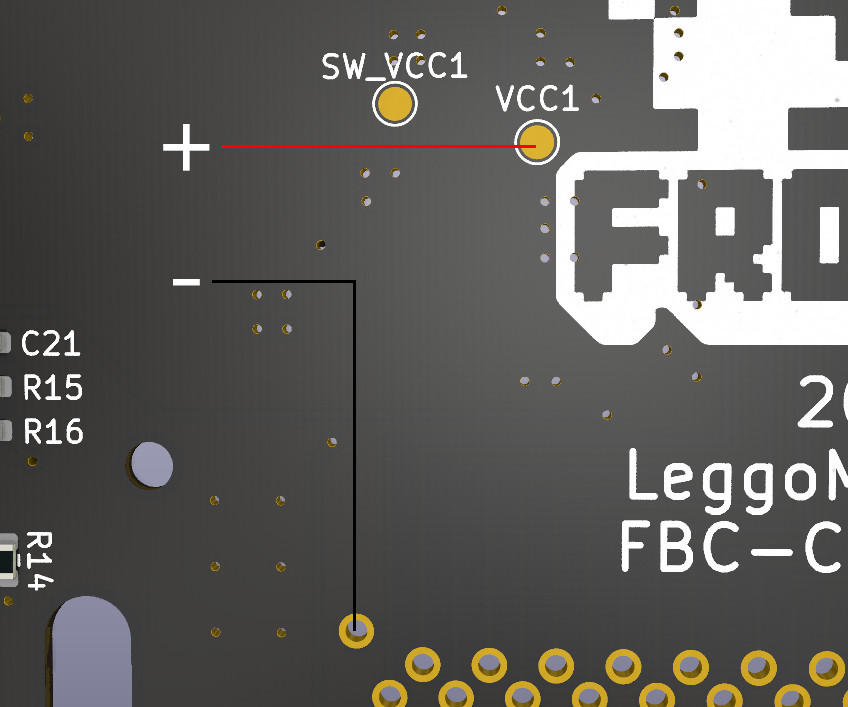
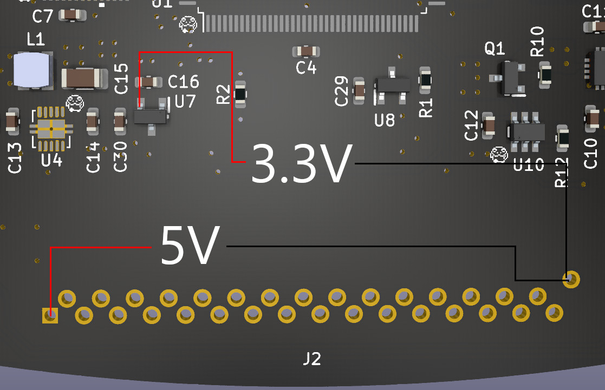
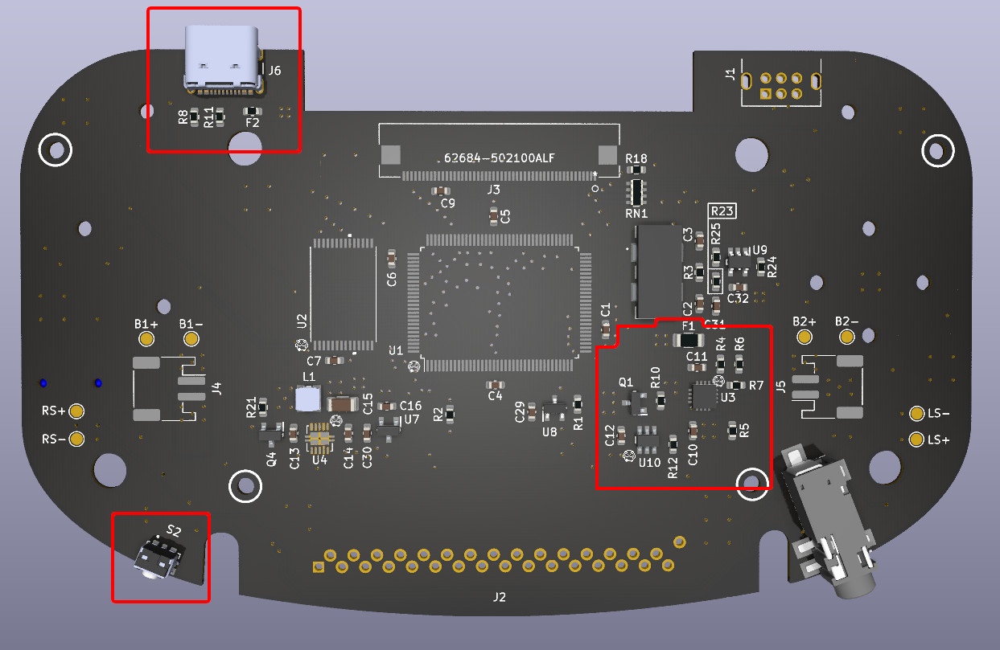
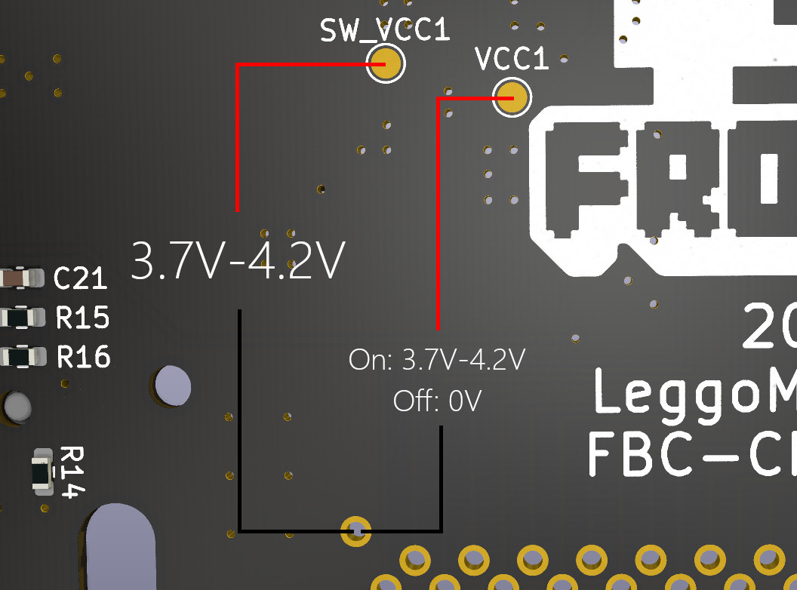

# Frog Boy Color

The Frog Boy Color is a reimagining of the Nintendo Game Boy Color, aka the greatest Game Boy ever made. Taking the best parts of a modded GBC -- large screen with correct aspect ratio, no cartridges sticking out, etc -- and marrying them to a horizontal format ala the GBA, the Frog Boy is the realization of exactly the kind of Game Boy I've wanted since I initially jumped into modding. 

Features include:
- All features of the original GBC minus IR -- use of GB/GBC cartridges, link cable, headphone jack, etc.
- Compatibie with popular laminated backlit screen kits from FunnyPlaying and others
- Dual speakers for stereo sound
- Internal battery rechargable via USB-C
- Tactile buttons like the GBA SP
- Two stage battery indicator

The following is a guide on how you can build your very own Frog Boy.

# Attribution
Before getting to the build, it's important to provide attribution to the other project(s) that have in part gone into the Frog Boy Color.
- **[Gekkio/gekkio-kicad-libs](https://github.com/Gekkio/gekkio-kicad-libs)**: The FBC incorporates several of Gekkio's excellent kicad symbols and footprints, including for the CPU, RAM(modified), link port, and cartridge connector(modified). Huge thanks to Gekkio for making these available for others to use!

# Disclaimer/Warning/For the love of God, read this
The Frog Boy is not an easy project, nor is it a professional product, and as such there are some things to keep in mind as you consider building one.

Assembly of the Frog Boy requires intermediate-advanced skills in soldering and electronics tinkering, including:
- Desoldering/soldering of large ICs
- Desoldering of through hole parts
- Soldering of small surface mount devices
- Soldering of leadless ICs, for example the TSP61202
- Proficiency with a multimeter for troubleshooting and validation
This is in no way a project for beginners, and if you don't have experience with the above, I highly recommend starting smaller -- solder practice kits are cheap and easily available.

Along with needing the requisite skills, there is a very real possibility that you will irreparably damage either your donor Game Boy Color, or the resulting Frog Boy. Even the most skilled among us make mistakes, but it's important to keep in mind your own limits to avoid heartache and sorrow.

I am in no way a professional electrical engineer. All of my skills are self taught, or learned from other members of the modding community. While I have taken common sense measures to ensure that the Frog Boy is functional and safe, I can not guarantee that each and every decision made is correct. Build at your own discretion.

In summary, build at your own risk. I am not liable for any damage or injury caused by your insatiable need to build a Game Boy named after an amphibian.

# Recommended Equipment
At a bare minimum, you should have:
- Temperature controlled soldering iron. I recommend the Pinecil as a great entry level option.
- Multimeter for troubleshooting. Any cheap digital multimeter from Amazon should do fine.
- Solder sucker for removing cartridge slot from donor GBC
- No clean flux

I highly recommend also having the following:
- A hot plate or hot air station for the QFN ICs, desoldering parts from GBC, etc
- Solder wick

# Bill of Materials(BOM)
Below is the breakdown of all materials you will need to build a Frog Boy Color.
## Build Components
- **PCB:** The Frog Boy Color uses a fully custom PCB designed to fit within the custom shell while still using many of the original GBC components. The following board parameters should be used:
  - **Layers:** 4-layer
  - **Thickness:** 1mm
  - **Surface finish:** HASL or ENIG
  - **Color:** Whatever you want
  - **Order from PCBWay**
- **Shell:** The shell for the Frog Boy Color is a fully custom design, and suitable for both resin printing and CNC machining. NOTE: When ordering in resin, there is a risk of the thin areas around the buttons and d-pad to break during fabrication.
  - **Order from PCBWay**
- **Screws:** The shell is designed to be put together using 13 x M2 4mm machine screws. For builds using a resin printed front shell, the cartridge shield screws can likely be reused for that purpose, which cuts M2 screws required to 9. Options:
  - **450pcs M2 M2.5 M3 Screw Kit:** [From Amazon](https://www.amazon.com/gp/product/B07TDHZJLL/)
- **Cartridge shield:** The metal cartridge shield from the GBC is used here for the same purpose. This can be sourced from your donor console, or from any aftermarket shell.
- **Buttons:** The Frog Boy Color uses buttons from the Game Boy Advance SP, either OEM or aftermarket. You will need a complete set, including the brightness button which is repurposed here as the power button. Some suggested buttons:
  - **FunnyPlaying:** [From RGRS](https://retrogamerepairshop.com/collections/gba-sp-buttons/products/funnyplaying-game-boy-advance-sp-buttons)
  - **RetroCNC(membrane version):** [From RGRS](https://retrogamerepairshop.com/collections/gba-sp-buttons/products/new-game-boy-sp-metal-buttons-by-retrocnc)
- **Membranes:** Similarly, the membranes used are also from the Game Boy Advance SP. You will need two sets of these in order to get two brightness button membranes for start/select. Some suggested membranes:
  - **FunnyPlaying:** [From RGRS](https://retrogamerepairshop.com/collections/gba-sp-buttons/products/funnyplaying-game-boy-advance-sp-silicone-pads)
- **Screen:** The FunnyPlaying laminated Q5 screen -- or a laminated Q5 from another manufacturer with the same total assembly thickness, such as from Gameneissance -- must be used in order to fit within the completed unit. Suggested options:
  - FunnyPlaying laminated Q5 screen + driver board: [From RGRS](https://retrogamerepairshop.com/collections/gbc-displays/products/funnyplaying-game-boy-color-2-0-q5-ips-laminated-backlight-kit)
  - FunnyPlaying laminated Q5 screen only: [From RGRS](https://retrogamerepairshop.com/collections/gbc-displays/products/funnyplaying-game-boy-color-2-0-q5-ips-laminated-lcd-replacement-screen-only)
- **Screen driver board:** For the screen driver board, you have two options:
  - FunnyPlaying GBC Retro Pixel 2.0 laminated IPS kit. This is the simplest option, as it can be purchased with the screen, and can be installed as is. The caveat is that the touch sensor will not work if you choose to install in an aluminum shell, and you'll need to connect the button controls.
    - FunnyPlaying driver board: [From FunnyPlaying](https://funnyplaying.com/products/gbc-retro-pixel-ips-2-0-replacement-ribbon)
  - Super OSD Retro Pixel IPS kit. An alternative to the FunnyPlaying kit with additional options. The downside is that you generally can not purchase it with a suitable laminated screen, and the board-to-board ribbon cable is rather stiff, which can cause assembly issues. The latter can be mitigated by using the custom replacement found under the `Accessories` folder.
    - Super OSD kit(for driver board only, screen too thick): [From RGRS](https://retrogamerepairshop.com/collections/gbc-displays/products/game-boy-color-laminated-q5-xl-ips-backlight-with-osd)
- **Batteries:** The Frog Boy Color can be built with either one or two 802040 LiPo pouch cells. One battery is a simpler arrangement, at the expense of battery life. Two batteries are more complicated, as you'll be required to balance two cells prior to assembly, but with the benefit of roughly double the battery life.
- **Light pipe:** An optional light pipe can be added for the indicator LEDs to better diffuse them. An STL for this can be found in `Accessories`. This should be printed with clear filament or resin.

  I also highly recommend printing/ordering the optional battery clips in the `Accessories` folder. They register with holes on each side of the PCB, and provide a nice clip and standoff for each of the batteries. Can be cheaply printed in SLS nylon from JLCPCB, PCBWay, etc.

  NOTE: LiPo batteries can be dangerous if mishandled. NEVER use unprotected cells. It's always safer to use one cell if you're unsure of your ability to properly balance two cells.
  Purchase options:
  - 802040 cell: [From AliExpress](https://www.aliexpress.us/item/3256802244810488.html?spm=a2g0o.order_list.order_list_main.16.43f61802KwXAj4&gatewayAdapt=glo2usa)
## PCB Components
- **Harvested GBC Parts:** You will need a donor GBC of revision CPU-05 or before -- CPU-06 revisions will NOT work -- that retains the following components in working order:
  - CPU
  - RAM
  - Crystal
  - Link port
  - Cartridge slot
- **New parts:** The full BOM for the Frog Boy Color be found in the repo, `BOM.xlsx`. Most parts are available from Mouser through a shared project. USB-C connector is available from LCSC. Most parts should be available from most other large distributors in case you want to build out your own cart. Some options:
  - Mouser: [Shared Project](https://www.mouser.com/ProjectManager/ProjectDetail.aspx?AccessID=2927c2105f)
  - LCSC: [USB-C connector](https://www.lcsc.com/product-detail/USB-Connectors_Korean-Hroparts-Elec-TYPE-C-31-M-12_C165948.html)

# Recommended Assembly Procedure
At this point, if you feel confident in your skills, you can proceed with the complete build from PCB to final unit -- assembly after building the PCB is relatively straightforward.

However, I've devised an assembly strategy after assembling a few units that will allow you to check your work along the way, and I highly recommend that you follow along.
## PCB Assembly
### 1. Assembling and testing power circuitry
The power circuitry consists of regulated 5V(TPS61202) and 3.3V(MCP1799T) rails. Start by populating all of the components in the red box on this diagram:

You'll then want to test these components to verify that the 5V and 3.3V rails are working correctly. Start by connecting one of your LiPo cells to the VCC1 test pad and pin 32(GND) on the cart slot -- I highly recommend using a multimeter in continuity mode to confirm that these points are not shorted.

Next, with your meter in DC voltage mode, do the following two tests to verify that the 5V and 3.3V rails are outputting the expected voltage.

If everything looks good, you're ready to proceed to the next step.
### 2. Assembling and testing battery charging circuitry
At the heart of the battery charging circuit is the BQ24072TRGTR, which provides both battery charging and power path management -- the latter allows for simultaneous charge and play. Alongside the charging circuitry is a soft latching power circuit, that allows for the use of a momentary push button switch to control power, in contrast to the GBC's slide switch.

Again, start by populating the components indicated below:

Now that the battery circuitry is assembled, a battery can be connected to one of the designated spots for integration testing of the entire power system, e.g B1+ and B1-. At this point, consider the system live any time a battery is connected -- do not do any soldering without first disconnecting all batteries. 

Once a battery is connected, put your meter into DC voltage mode and perform the following tests. 

For context, SW_VCC1 is live regardless of power state, and should read roughly the same voltage as the battery at all times. VCC1 is the output of the power switch, and should read 0V when the system is off, and roughly battery voltage when the system is on. Press the power switch to cycle between off and on and take measurements to verify that VCC1 reads the correct values. Now is also a good time to verify that your 5V and 3.3V power rails come up when the system is on.

At this point, assuming everything reads correctly, you can be reasonably certain nothing will get fried, and can proceed to the next step. We'll verify battery charging at a later time.

### 3. Installing core GBC pieces
At this point we get to the heart of the system, which is composed of the CPU, RAM, crystal, reset circuitry, display connector, and their support circuitry. The following components should be populated:

With the core components populated at this point, you should now have a semi-functional Frog Boy. To test, connect a battery like in step 2, plug in your screen kit of choice, and power on the system. You should be greeted with the iconic GBC boot screen.

#### Troubleshooting:
This is where things might start to go off the rails, given the number of pins on each of these components. Even one floating pin can cause noticeable problems. Here are some potential problems and solutions.

- **Black screen:** Might indicate a short or floating pin on any of the installed components. Verify all of the power measurements from steps 1 and 2 to rule out major shorts. Double check all of the CPU, RAM, and display connector pins for bridges and floating pins.
- **White screen:** Might indicate a problem with the reset circuitry. Make sure there are no floating pins on U8, C29, R1, or CPU pin 35.
- **Weird colors on screen:** Indicative of bridged/floating pins on the RAM, top of the CPU, or display connector. Go over each connection to make sure there are no bridges or floating pins.

### 4. Assembly of remaining circuitry
With the QFNs and large ICs out of the way, the remainder of the PCB assembly is relatively straightforward, and I have little more to offer in terms of order of assembly or testing.

The remaining bits are a pair of LM4875 audio amplifiers for the stereo audio and the associated circuitry for that, the battery indicator circuit, the cartridge port, and the link port circuitry. Except for testing, speakers should not be connected until final unit assembly.

Battery charging can be tested at this point by connecting a battery to the proper spot on the board, and then plugging in a USB-C cable. If charging is working correctly, you should see the charge indicator light on the front of the board turn on and stay on during the duration of charging.

One thing I do recommend is to install the tac switches _last_. It's highly advisable that you give the entire board a good clean with IPA to remove any residual flux or other gunk. Doing so with the tac switches installed may carry crap into said switches, which can cause problems with their responsiveness.

### Troubleshooting:
- **Charge light doesn't come on:** Verify that the 5V from USB makes it to the right side of F2. If it does, check the soldering on the charge indicator LED and the charge IC. If there's still no charge indicator, double check that the LED is working using a multimeter in diode mode. If all else fails, the charge IC might be dead.
- **Charge light comes on that shuts off immediately:** Charge IC is most likely dead. Give it a reflow prior to replacing, just to be certain.

## Final Assembly
Assembly of the final unit after successfully building the PCB is relatively straightforward, but here are some component specific pointers.

### Speakers
In contrast to OEM Game Boys, speaker polarity matters in the case of the FBC, at least between the two speakers. The same terminal on each speaker should connect to the same polarity speaker pad on the motherboard, e.g. left to positive, right to negative. If the speakers are connected with polarity reversed relative to eachother, destructive interference will cancel out much of the audio.

To keep the speakers in place before placing the PCB, I recommend placing a thin piece of double sided tape to the front edge of each speaker.

### Cartridge shield
With the current shell design in some materials, the cartridge shield may cause cartridges to not sit perfectly flush with the back of the unit. This will be fixed in a future iteration of the shell, but if you encounter this issue, simply back off the screws on the cartridge shield about 1/2 turn so it's slightly loose.

### Screen kit controls
I highly recommend connecting the controls for whatever screen kit you've chosen to the button test points on the front of the FBC board. While touch sensors in general work okay in plastic shells, they can still be flakey, and don't work at all in metal shells. It's recommended to cut off the touch sensor in this case to prevent accidental triggers.

### Assembly video
To get an overview of the assembly process, check out my video about the Frog Boy Color: [YouTube](https://youtu.be/_rRCEbcjiho)
